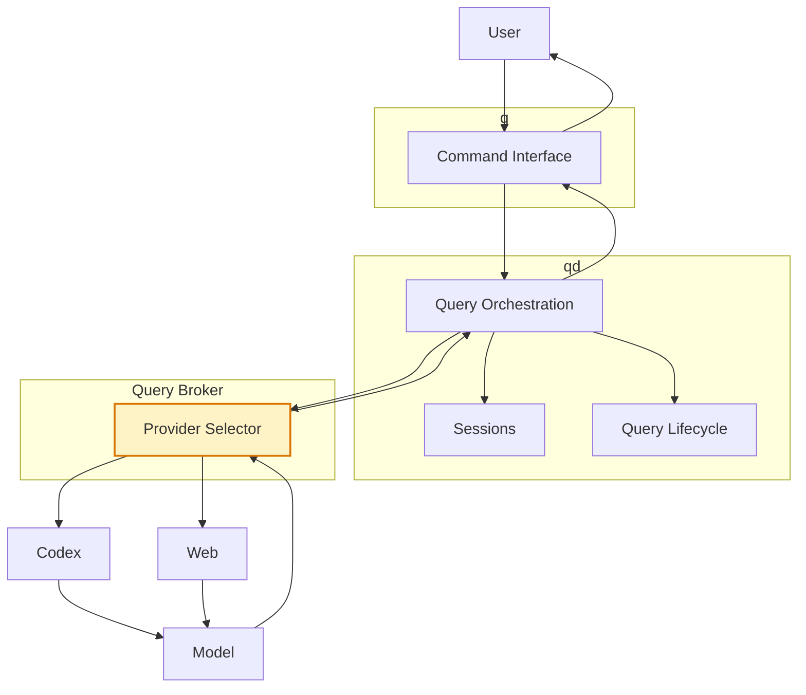

# chatgpt-query-broker

`chatgpt-query-broker` is the provider-selection layer between q/qd and the AI providers available to it.

It exposes one query interface to qd and routes each query to the selected provider while keeping provider-specific behavior behind the broker boundary.

## Architecture



Within the wider q/qd architecture, `chatgpt-query-broker` owns provider selection. qd submits queries through the broker without needing to implement each provider directly.

## Installation

Requirements:

- Python 3.13+
- at least one configured provider
- Codex installed and authenticated when using the Codex provider
- `chatgpt-web-provider` available when using the Web provider

Install from the repository:

```sh
python3 -m venv .venv
. .venv/bin/activate
pip install -e .
```

Enable at least one provider through the broker environment.

Codex example:

```sh
export CHATGPT_QUERY_BROKER_CODEX_ENABLED=true
```

Web example:

```sh
export CHATGPT_QUERY_BROKER_WEB_ENABLED=true
export CHATGPT_QUERY_BROKER_WEB_BASE_URL=http://127.0.0.1:8791
export CHATGPT_QUERY_BROKER_WEB_API_KEY="$CHATGPT_WEB_API_KEY"
```

Start the broker:

```sh
chatgpt-query-broker
```

The default local endpoint is:

```text
http://127.0.0.1:8792
```

See [docs/installation.md](docs/installation.md) and [docs/configuration.md](docs/configuration.md) for detailed setup.

## Usage

Check broker health:

```sh
curl -s http://127.0.0.1:8792/health
```

Submit a query through the Codex provider:

```sh
curl -N \
  -H 'Content-Type: application/json' \
  http://127.0.0.1:8792/v1/query \
  -d '{
    "input": "Say exactly: pong",
    "cwd": "/tmp",
    "model": "gpt-6-luna",
    "reasoning_effort": "high",
    "backend": "codex"
  }'
```

Submit through the Web provider:

```sh
curl -N \
  -H 'Content-Type: application/json' \
  http://127.0.0.1:8792/v1/query \
  -d '{
    "input": "Say exactly: pong",
    "cwd": "/tmp",
    "model": "gpt-6-luna",
    "reasoning_effort": "high",
    "backend": "web"
  }'
```

The public request field remains named `backend` for wire compatibility; architecturally, the broker treats these as provider selections.

Further documentation:

- [Installation](docs/installation.md)
- [Configuration](docs/configuration.md)
- [API](docs/api.md)
- [Providers](docs/providers.md)
- [Provider routing and identifiers](docs/routing.md)
- [Operations](docs/operations.md)
- [Security](docs/security.md)
- [Development](docs/development.md)
